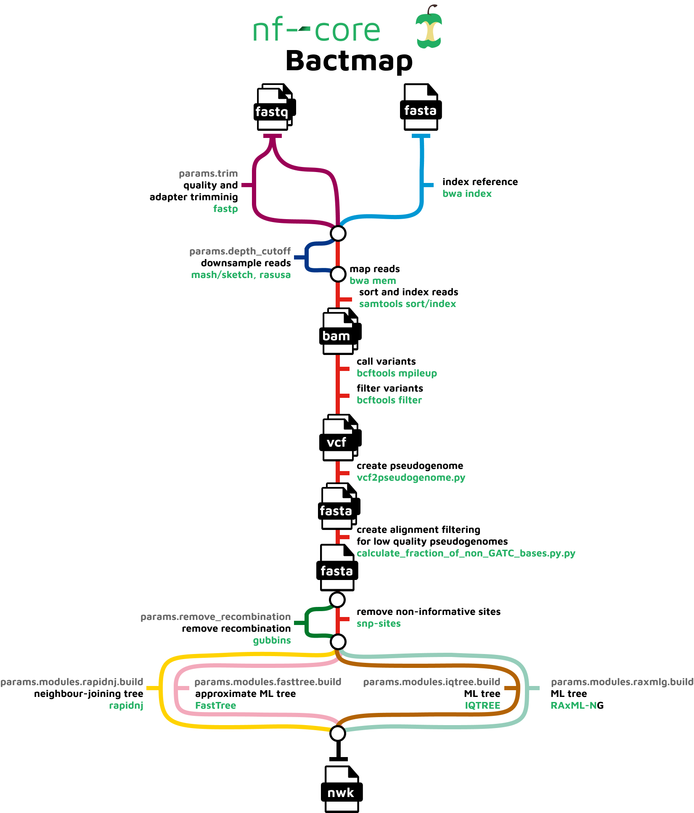

# 

[](https://github.com/nf-core/bactmap/actions?query=workflow%3A%22nf-core+CI%22)
[](https://github.com/nf-core/bactmap/actions?query=workflow%3A%22nf-core+linting%22)
[](https://nf-co.re/bactmap/results)
[](https://doi.org/10.5281/zenodo.XXXXXXX)

[](https://www.nextflow.io/)
[](https://docs.conda.io/en/latest/)
[](https://www.docker.com/)
[](https://sylabs.io/docs/)

[](https://nfcore.slack.com/channels/bactmap)
[](https://twitter.com/nf_core)
[](https://www.youtube.com/c/nf-core)

## Introduction

**nf-core/bactmap** is a bioinformatics best-practice analysis pipeline for mapping short reads from bacterial WGS to a reference sequence, creating filtered VCF files, making pseudogenomes based on high quality positions in the VCF files and optionally creating a phylogeny from an alignment of the pseudogenomes.

The pipeline is built using [Nextflow](https://www.nextflow.io), a workflow tool to run tasks across multiple compute infrastructures in a very portable manner. It uses Docker/Singularity containers making installation trivial and results highly reproducible. The [Nextflow DSL2](https://www.nextflow.io/docs/latest/dsl2.html) implementation of this pipeline uses one container per process which makes it much easier to maintain and update software dependencies. Where possible, these processes have been submitted to and installed from [nf-core/modules](https://github.com/nf-core/modules) in order to make them available to all nf-core pipelines, and to everyone within the Nextflow community!

On release, automated continuous integration tests run the pipeline on a full-sized dataset on the AWS cloud infrastructure. This ensures that the pipeline runs on AWS, has sensible resource allocation defaults set to run on real-world datasets, and permits the persistent storage of results to benchmark between pipeline releases and other analysis sources. The results obtained from the full-sized test can be viewed on the [nf-core website](https://nf-co.re/bactmap/results).

## Pipeline summary



The pipeline is composed of the following steps:

1. Index reference fasta file ([`BWA index`](https://github.com/lh3/bwa))
2. Trim reads for quality and adapter sequence (Optional) ([`fastp`](https://github.com/OpenGene/fastp))
3. Estimate genome size ([`mash sketch`](https://mash.readthedocs.io/en/latest/index.html))
4. Downsample fastq files (Optional) ([`Rasusa`](https://github.com/mbhall88/rasusa))
5. Variant calling
    1. Read mapping ([`BWA mem`](https://github.com/lh3/bwa))
    2. Sort and index alignments ([`SAMtools`](https://sourceforge.net/projects/samtools/files/samtools/))
    3. Call and filter variants ([`BCFtools`](http://samtools.github.io/bcftools/bcftools.html))
    4. Convert filtered bcf to pseudogenome fasta ([`vcf2pseudogenome.py`](https://github.com/nf-core/bactmap/blob/dev/bin/vcf2pseudogenome.py))
6. Create alignment from pseudogenome by concatenating fasta files having first checked that the sample sequences are high quality([`calculate_fraction_of_non_GATC_bases.py`](https://github.com/nf-core/bactmap/blob/dev/bin/))
7. Remove recombination (Optional) ([`Gubbins`](https://sanger-pathogens.github.io/gubbins/))
8. Extract variant sites from alignment ([`SNP-sites`](https://github.com/sanger-pathogens/snp-sites))
9. Construct phylogenetic tree (Optional)
    1. Fast/less accurate
        * neighbour joining [`RapidNJ`](https://birc.au.dk/software/rapidnj/)
        * approximate maximum likelihood [`FastTree2`](http://www.microbesonline.org/fasttree/))
    2. Slow/more accurate, maximum likelihood
        * [`IQ-TREE`](http://www.iqtree.org/),
        * [`RAxML-NG`](https://github.com/amkozlov/raxml-ng)

## Quick Start

1. Install [`Nextflow`](https://nf-co.re/usage/installation) (`>=21.04.0`)

2. Install any of [`Docker`](https://docs.docker.com/engine/installation/), [`Singularity`](https://www.sylabs.io/guides/3.0/user-guide/), [`Podman`](https://podman.io/), [`Shifter`](https://nersc.gitlab.io/development/shifter/how-to-use/) or [`Charliecloud`](https://hpc.github.io/charliecloud/) for full pipeline reproducibility _(please only use [`Conda`](https://conda.io/miniconda.html) as a last resort; see [docs](https://nf-co.re/usage/configuration#basic-configuration-profiles))_

3. Download the pipeline and test it on a minimal dataset with a single command:

    ```console
    nextflow run nf-core/bactmap -profile test,<docker/singularity/podman/shifter/charliecloud/conda/institute>
    ```

    > * Please check [nf-core/configs](https://github.com/nf-core/configs#documentation) to see if a custom config file to run nf-core pipelines already exists for your Institute. If so, you can simply use `-profile <institute>` in your command. This will enable either `docker` or `singularity` and set the appropriate execution settings for your local compute environment.
    > * If you are using `singularity` then the pipeline will auto-detect this and attempt to download the Singularity images directly as opposed to performing a conversion from Docker images. If you are persistently observing issues downloading Singularity images directly due to timeout or network issues then please use the `--singularity_pull_docker_container` parameter to pull and convert the Docker image instead. Alternatively, it is highly recommended to use the [`nf-core download`](https://nf-co.re/tools/#downloading-pipelines-for-offline-use) command to pre-download all of the required containers before running the pipeline and to set the [`NXF_SINGULARITY_CACHEDIR` or `singularity.cacheDir`](https://www.nextflow.io/docs/latest/singularity.html?#singularity-docker-hub) Nextflow options to be able to store and re-use the images from a central location for future pipeline runs.
    > * If you are using `conda`, it is highly recommended to use the [`NXF_CONDA_CACHEDIR` or `conda.cacheDir`](https://www.nextflow.io/docs/latest/conda.html) settings to store the environments in a central location for future pipeline runs.

4. Start running your own analysis!

    ```console
    nextflow run nf-core/bactmap -profile <docker/singularity/podman/conda/institute> --input samplesheet.csv --reference chromosome.fasta
    ```

## Documentation

The nf-core/bactmap pipeline comes with documentation about the pipeline [usage](https://nf-co.re/bactmap/usage), [parameters](https://nf-co.re/bactmap/parameters) and [output](https://nf-co.re/bactmap/output).

## Credits

nf-core/bactmap was originally written by [Anthony Underwood](https://github.com/aunderwo), [Andries van Tonder](https://github.com/avantonder) and [Thanh Le Viet](https://github.com/thanhleviet).

We thank the following people for their extensive assistance in the development
of this pipeline:

* [Alexandre Gilardet](https://github.com/alexandregilardet)
* [Harshil Patel](https://github.com/drpatelh)

Anthony Underwood's time working on the project was funded by the National Institute for Health Research
(NIHR) Global Health Research Unit for the Surveillance of Antimicrobial Resistance (Grant Reference Number 16/136/111)


## Contributions and Support

If you would like to contribute to this pipeline, please see the [contributing guidelines](.github/CONTRIBUTING.md).

For further information or help, don't hesitate to get in touch on the [Slack `#bactmap` channel](https://nfcore.slack.com/channels/bactmap) (you can join with [this invite](https://nf-co.re/join/slack)).

## Citations

<!-- TODO nf-core: Add citation for pipeline after first release. Uncomment lines below, update Zenodo doi and badge at the top of this file. -->
<!-- If you use  nf-core/bactmap for your analysis, please cite it using the following doi: [10.5281/zenodo.XXXXXX](https://doi.org/10.5281/zenodo.XXXXXX) -->
An extensive list of references for the tools used by the pipeline can be found in the [`CITATIONS.md`](CITATIONS.md) file.

You can cite the `nf-core` publication as follows:

> **The nf-core framework for community-curated bioinformatics pipelines.**
>
> Philip Ewels, Alexander Peltzer, Sven Fillinger, Harshil Patel, Johannes Alneberg, Andreas Wilm, Maxime Ulysse Garcia, Paolo Di Tommaso & Sven Nahnsen.
>
> _Nat Biotechnol._ 2020 Feb 13. doi: [10.1038/s41587-020-0439-x](https://dx.doi.org/10.1038/s41587-020-0439-x).
