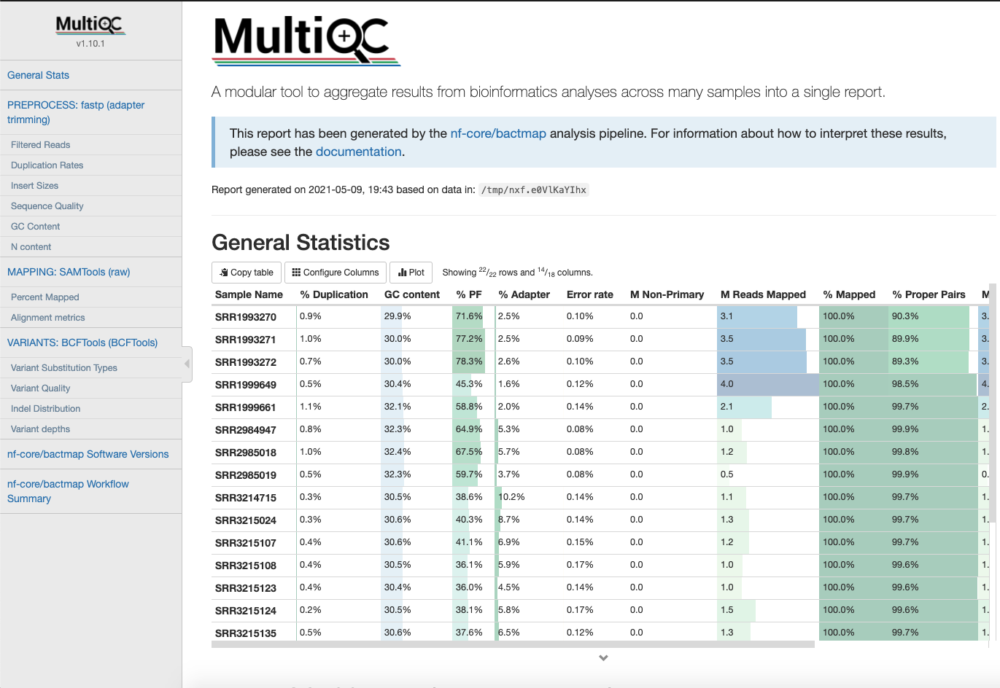
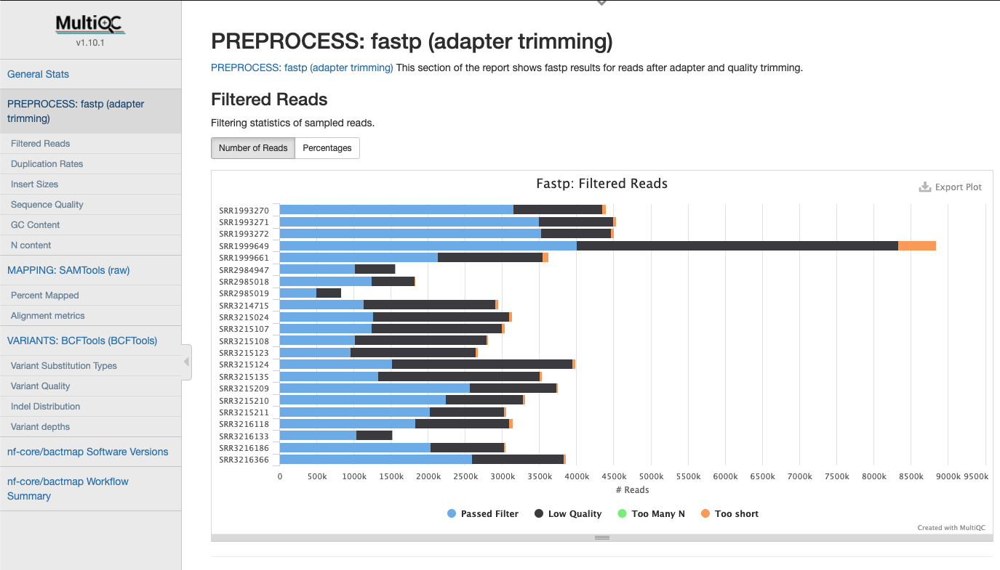
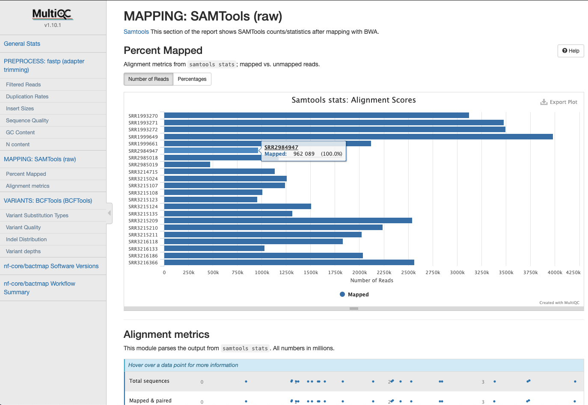
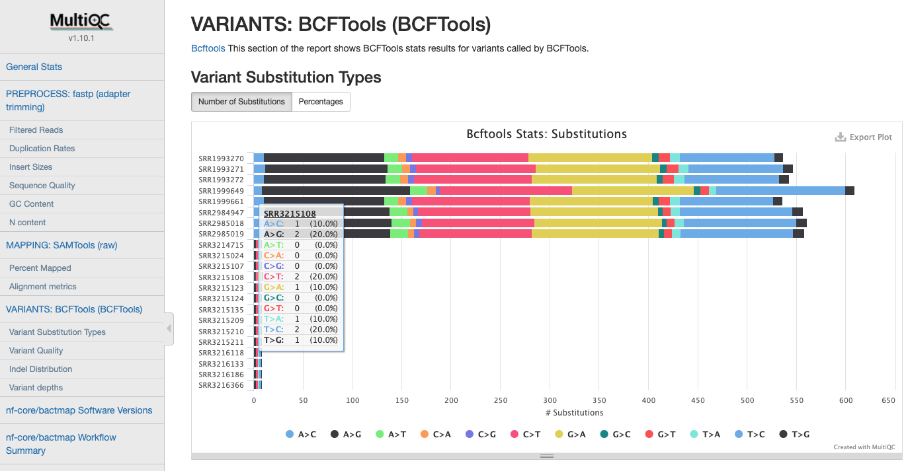

# nf-core/bactmap: Output

## :warning: Please read this documentation on the nf-core website: [https://nf-co.re/bactmap/output](https://nf-co.re/bactmap/output)

> _Documentation of pipeline parameters is generated automatically from the pipeline schema and can no longer be found in markdown files._

## Introduction

This document describes the output produced by the pipeline.

The directories listed below will be created in the results directory after the pipeline has finished. All paths are relative to the top-level results directory.

## Pipeline overview

The pipeline is built using [Nextflow](https://www.nextflow.io/) and processes data using the following steps:

* [`Reference indexing`](#reference-indexing)
* [`Read trimming`](#read-trimming)
* [`Read subsampling`](#read-subsampling)
* [`Read mapping`](#read-mapping)
* [`Sort bam files`](#sort-bam-files)
* [`Call and filter variants`](#call-and-filter-variants)
* [`Convert filtered vcf to pseudogenome`](#convert-filtered-vcf-to-pseudogenome)
* [`Create alignment from pseudogenomes`](#create-alignment-from-pseudogenomes)
* [`Remove recombination (Optional)`](#remove-recombination)
* [`Remove non-informative positions`](#remove-non-informative-positions)
* Construct phylogenetic tree (Optional)
    1. Fast/less accurate
        * [`RapidNJ`](#rapidnj)
        * [`FastTree2`](#fasttree)
    2. Slow/more accurate, maximum likelihood
        * [`IQ-TREE`](#iq-tree),
        * [`RAxML-NG`](#raxml-ng)
* [Pipeline information](#pipeline-information) - Report metrics generated during the workflow execution

### Reference Indexing

In order to map the reads to the reference sequence it indexed.

Output files

* `bwa/index.`
    * `*.amb`
    * `*.ann`
    * `*.bwt`
    * `*.pac`
    * `*.sa`

> These files are generally not required except for in the mapping step

### Read Trimming

The `fastp` software is used to trim the fastq input files.

Output files

* `fastp/`
    * `*.html` html reports of the trimming process that can be opened in any modern web browser. See [here](http://opengene.org/fastp/fastp.html) for an example
    * `*.json` trimming report metrics in JSON computer readable formats. See [here](http://opengene.org/fastp/fastp.json) for an example

### Read Subsampling

The `rasusa` software is used to subsample reads to a depth cutoff of a default of 100 (unless the `--subsampling_off` flag is set)

Output files

* `rasusa/`
    * `*.fastq.gz` subsamples fastq files

### Read Mapping

By default there are the bam files created are not saved since sorted bam files are produced in the next step

### Sort Bam Files

After mapping the bam files are sorted and statistics calculated.

Output files

* `samtools/`
    * `*.bam` sorted bam files
    * `*.bam.bai` bam file index
    * `*.bam.flagstat` bam file metrics
    * `*.bam.idxstats` bam file metrics
    * `*.bam.stats` bam file metrics

### Call and Filter Variants

The `bcftools` software is used to call and filter variants found within the bam files.

Output files

* `variants/`
    * `*.vcf.gz` filtered vcf files containing variants

### Convert Filtered VCF to Pseudogenome

The filtered vcf files are converted to a pseudogenome.

Output files

* `pseudogenomes/`
    * `*.fas` pseudogenome with a base at each position of the reference sequence

### Create Alignment from Pseudogenomes

Only those pseudogenome fasta files that have a non-ACGT fraction less than the threshold specified will be included in the `aligned_pseudogenomes.fas` file. Those failing this will be reported in the `low_quality_pseudogenomes.tsv` file.

Output files

* `pseudogenomes/`
    * `aligned_pseudogenomes.fas` alignment of all sample pseudogenomes and the reference sequence
    * `low_quality_pseudogenomes.tsv` a tab separated file of the samples that failed the non-ACGT base threshold

### Remove Recombination

The file used for downstream tree building is `aligned_pseudogenomes.filtered_polymorphic_sites.fasta`. The other files are described in the [gubbins documentation](https://github.com/sanger-pathogens/gubbins#output-files)

Output files

* `gubbins/`
    * `aligned_pseudogenomes.branch_base_reconstruction.embl`
    * `aligned_pseudogenomes.filtered_polymorphic_sites.fasta`
    * `aligned_pseudogenomes.filtered_polymorphic_sites.phylip`
    * `aligned_pseudogenomes.final_tree.tre`
    * `aligned_pseudogenomes.node_labelled.final_tree.tre`
    * `aligned_pseudogenomes.per_branch_statistics.csv`
    * `aligned_pseudogenomes.recombination_predictions.embl`
    * `aligned_pseudogenomes.recombination_predictions.gff`
    * `aligned_pseudogenomes.summary_of_snp_distribution.vcf`

### Remove Non-informative Positions

Before building trees, non-informative constant sites are removed from the alignment using `snp-sites`

Output files

* `snpsites/`
    * `constant.sites.txt` A file with the number of constant sites for each base
    * `filtered_alignment.fas` Alignment with only informative positions (those positions that have at least one alternative variant base)

### RapidNJ

Output files

* `rapidnj/`
    * `rapidnj_phylogeny.tre` A newick tree built with RapidNJ

### FastTree

A newick tree is produced in

* `fasttree/`
    * `fasttree_phylogeny.tre` A newick tree built with FastTree

### IQ-TREE

A newick tree is produced in

* `iqtree/`
    * `*.treefile` A ML tree built with IQ-TREE with support values for branches based on bootstrapping

### RAxML-NG

A newick tree is produced in

* `iqtree/`
    * `output.raxml.bestTree` A ML tree built with RAxML-NG selected as the best after running ML
    * `output.raxml.support` A ML tree built with RAxML-NG with support values for branches based on bootstrapping

### MultiQC

Quality statistics from the fastq files post trimmimg with `fastp`, bam files after mapping with `bwa`, and vcf files after variants are called using `bcftools` are compiled from the previous outputs using the [MultiQC](https://multiqc.info/) software:

#### Overall Statistics

A compilation of statistics about read content, mapping and variants

#### FastP Statistics

Statistics gathered when trimming reads

#### Mapping Statistics

Statistics gathered when mapping reads

#### Variant Statistics

Statistics gathered when calling variants after filtering

### Pipeline information

Output files

* `pipeline_info/`
    * Reports generated by Nextflow: `execution_report.html`, `execution_timeline.html`, `execution_trace.txt` and `pipeline_dag.dot`/`pipeline_dag.svg`.
    * Reports generated by the pipeline: `pipeline_report.html`, `pipeline_report.txt` and `software_versions.tsv`.
    * Reformatted samplesheet files used as input to the pipeline: `samplesheet.valid.csv`.

[Nextflow](https://www.nextflow.io/docs/latest/tracing.html) provides excellent functionality for generating various reports relevant to the running and execution of the pipeline. This will allow you to troubleshoot errors with the running of the pipeline, and also provide you with other information such as launch commands, run times and resource usage.
